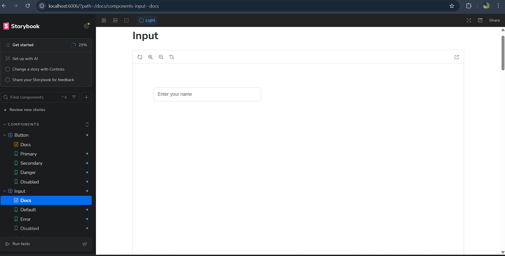
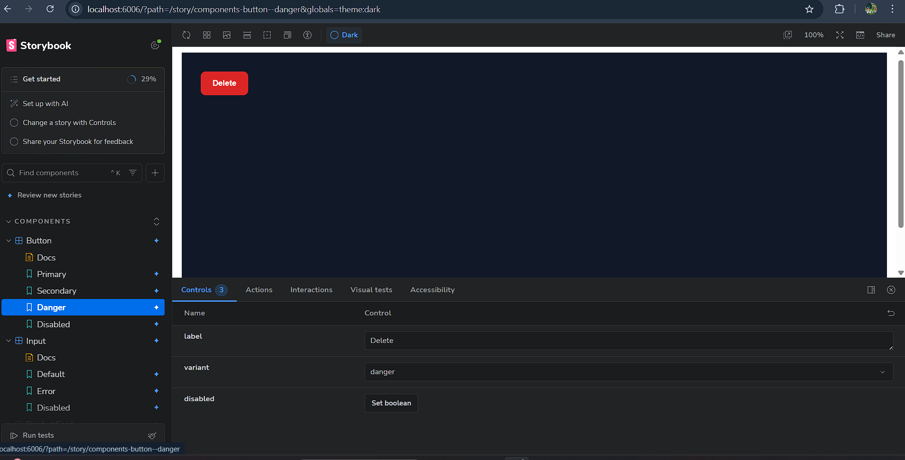

# Storybook Design System

A component-driven UI library built using Storybook and Next.js, demonstrating isolated component development, interactive documentation, theme management, and reusable design system architecture.

## project live link: 

## snapshots



## Overview

This project showcases the principles of Component Driven Development (CDD), where UI components are developed, tested, and documented independently from the main application. The design system provides a consistent and scalable foundation for building modern web applications.

The implementation focuses on reusability, maintainability, visual consistency, and developer experience through Storybook's interactive environment.

---

## Objectives

* Develop UI components in complete isolation using Storybook.
* Create reusable and configurable components through props and Storybook Args.
* Implement a centralized theming system with Light and Dark mode support.
* Generate static Storybook documentation for deployment and sharing.
* Follow industry-standard frontend engineering practices used by large-scale organizations.

---

## Tech Stack

| Technology         | Purpose                               |
| ------------------ | ------------------------------------- |
| Next.js            | React Framework                       |
| React              | UI Development                        |
| TypeScript         | Type Safety                           |
| Storybook          | Component Development & Documentation |
| Vite               | Storybook Build System                |
| CSS                | Component Styling                     |
| Chromatic / Vercel | Deployment Platform                   |

---

## Project Structure

```text
src/
│
├── components/
│   │
│   ├── Button/
│   │   ├── Button.jsx
│   │   ├── Button.css
│   │   └── Button.stories.jsx
│   │
│   ├── Input/
│   │   ├── Input.jsx
│   │   ├── Input.css
│   │   └── Input.stories.jsx
│   │
│   └── ProductCard/
│       ├── ProductCard.jsx
│       ├── ProductCard.css
│       └── ProductCard.stories.jsx
│
├── styles/
│   ├── globals.css
│   └── themes.css
│
└── app/
```

---

## Components

### Button

Reusable button component supporting multiple visual states.

#### Variants

* Primary
* Secondary
* Danger
* Disabled

#### Features

* Configurable label
* Variant-based styling
* Disabled state support
* Interactive Storybook controls

---

### Input

Reusable input field component designed for form usage.

#### Variants

* Default
* Error
* Disabled

#### Features

* Custom placeholder support
* Validation state styling
* Disabled state handling
* Interactive controls panel

---

### ProductCard

Product display component commonly used in e-commerce interfaces.

#### Variants

* Default Product
* Out of Stock Product
* Premium Product

#### Features

* Product image rendering
* Dynamic title and pricing
* Inventory status indicators
* Reusable card architecture

---

## Theming

The design system supports global theme switching through Storybook decorators and CSS variables.

### Available Themes

* Light Mode
* Dark Mode

### Theme Features

* Centralized design tokens
* Consistent component rendering
* Runtime theme switching
* Storybook toolbar integration

---

## Storybook Features

### Component Isolation

Each component is developed independently from the main application to ensure:

* Reusability
* Maintainability
* Scalability
* Testability

### Interactive Controls (Args)

Storybook Controls allow real-time manipulation of component properties without modifying source code.

Examples:

* Button variants
* Input states
* Product information
* Theme switching

### Auto Documentation

Storybook automatically generates documentation for component properties, states, and usage examples.

---

## Local Development

### Install Dependencies

```bash
npm install
```

### Run Storybook

```bash
npm run storybook
```

Storybook will be available at:

```text
http://localhost:6006
```

### Run Next.js Application

```bash
npm run dev
```

---

## Production Build

Generate a static Storybook build:

```bash
npm run build-storybook
```

Output directory:

```text
storybook-static/
```

---

## Deployment

The generated Storybook build can be deployed to:

* Vercel
* Chromatic
* Netlify
* GitHub Pages

Deployment is performed using the static output generated by:

```bash
npm run build-storybook
```

---

## Engineering Concepts Demonstrated

* Component Driven Development (CDD)
* Design Systems
* Storybook Architecture
* Reusable UI Components
* Theme Management
* Interactive Documentation
* Props and State Variants
* Static Site Generation
* Frontend Scalability Practices

---

## Future Enhancements

* Modal Component
* Navbar Component
* Dropdown Component
* Toast Notifications
* Form Validation Library Integration
* Visual Regression Testing
* Unit Testing with Vitest
* Accessibility Auditing Enhancements

---
Mission 12